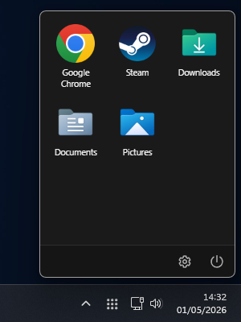
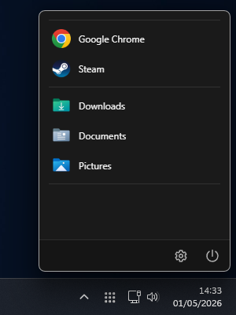
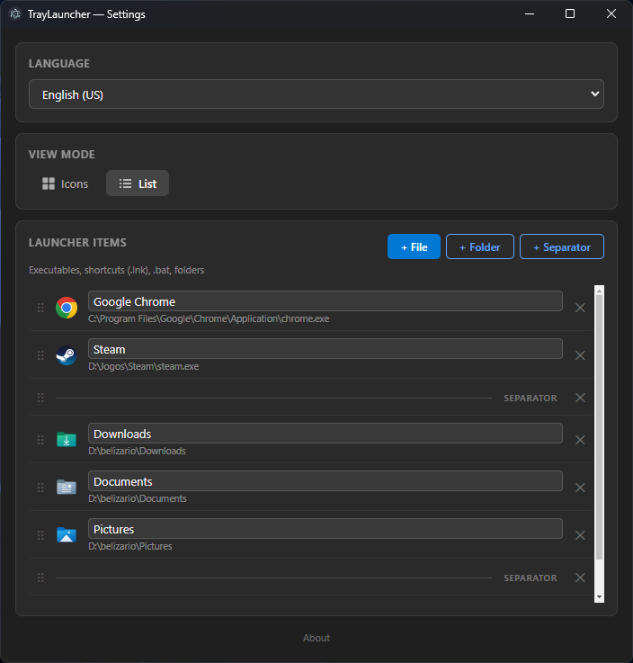

# TrayLauncher

A lightweight system tray application launcher for Windows, built with [Electron](https://www.electronjs.org/).  
Click the tray icon to instantly access your favorite apps, folders, and shortcuts — without cluttering your taskbar.

## Screenshots

### Icon view


### List view


### Settings


## Features

- **System tray launcher** — lives quietly in the notification area; click to open, click away to close
- **Two view modes** — grid (icons) or compact list
- **Custom icons** — extract icons from any `.exe`, `.ico`, `.dll` or `.lnk` file
- **Drag-and-drop reordering** — rearrange items by dragging
- **Separators** — visually group items
- **Inline rename** — click any item name to rename it in place
- **Multilingual** — English (US), Portuguese (Brazil), and Spanish (Spain)
- **Follows system theme** — automatic dark / light mode
- **Resizable settings window** — window size is remembered between sessions
- **Portable** — single `.exe`, no installation required

## Requirements

- Windows 10 / 11 (x64)

## Download

Grab the latest `TrayLauncher-portable.exe` from the [Releases](../../releases) page and run it — no installation needed.

## Building from Source

```bash
# Install dependencies
npm install

# Run in development
npm start

# Build portable executable
npm run build
```

> Requires [Node.js](https://nodejs.org/) 18+ and [Bun](https://bun.sh/) (optional, for faster installs).

The output executable will be placed in `dist/TrayLauncher-portable.exe`.

## Usage

1. Launch `TrayLauncher-portable.exe` — an icon appears in the system tray.
2. **Left-click** the tray icon to open the launcher.
3. Click any item to launch it. Click outside the popup to dismiss it.
4. **Right-click** the tray icon → **Settings** to configure items.
5. In Settings:
   - Add files, folders, or separators with the **+ File / + Folder / + Separator** buttons.
   - Drag the `⠿` handle to reorder items.
   - Click an item's icon to replace it with one extracted from any executable.
   - Click an item's name to rename it.
   - Switch between **Icons** and **List** view modes.
   - Change the display language.

## Tech Stack

| Layer | Technology |
|---|---|
| Runtime | Electron |
| UI | Vanilla HTML / CSS / JS |
| Icons | Native icon extraction via Electron's `nativeImage` |
| Build | electron-builder |

## License

MIT — see [LICENSE](LICENSE).

## Author

**Belizário G. Ribeiro Filho** — [belizariogr@gmail.com](mailto:belizariogr@gmail.com)
